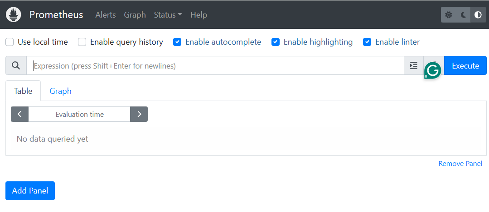
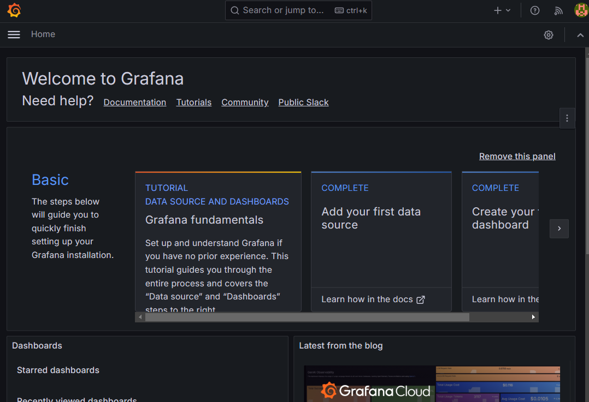
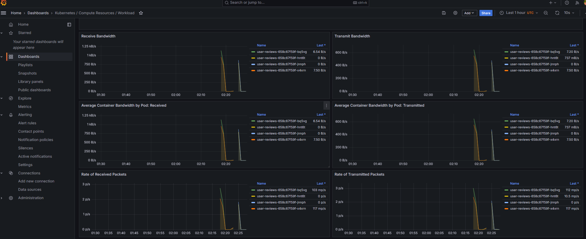
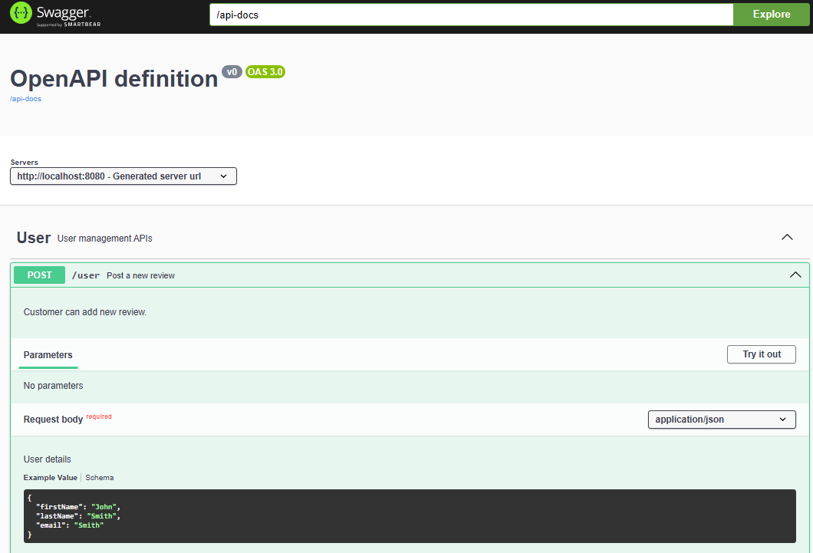
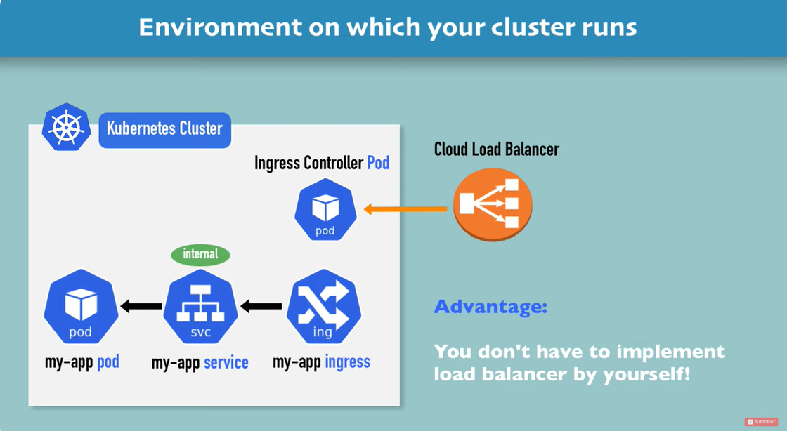

## Installation
Couple of options to try it out.
 - Using AWS EKS
 - Using Minikube

## Using AWS EKS - Prerequisites:
* AWS account
* Kubernetes CLI installed
* Kubectl installed
* AWS CLI installed
* Terraform installed
* Basic Terraform knowledge and experience
* Basic Kubernetes knowledge and experience
* Cloud9 or similar IDE

## Folder structure
* iac : contains the terraform scripts to create the EKS Cluster
* k8-services : contains K8 deployment and services. (Note: If you prefer you can separate the deployment and services)

### Preparation
* Set Up AWS Credentials
Set up your AWS user access key and secret access key variables in the AWS CLI using the following:
```
export AWS_ACCESS_KEY_ID="<access_key>"
export AWS_SECRET_ACCESS_KEY="<secret_key>"
```

* Check kubectl installed or not
```kubectl version --short--client```

* <a href="https://docs.aws.amazon.com/eks/latest/userguide/install-kubectl.html">Follow the guide to install kubectl</a>
* Configure kubectl : ```aws eks update-kubeconfig --region <region> --name <cluster_name>```
* Get K8 Cluster info: ```kubectl cluster-info```
* Get node list : ```kubectl get nodes```
* Clean up your resources using the following command: ```terraform destroy```

## Create EKS Cluster
* Change to di and apply rectory iac/k8-cluster
* Modify the variables.tf as needed
* Initialize, validate and apply Terraform
```
terraform init
terraform fmt
terraform validate
terraform apply --auto-approve=true
```

## Collect DB details to set the environment variables
* Output values for mysql_db_url and mysql_host
* Update the user-reviews.properties file.


## Deploying services
* Change to k8-services folder
* Connect to EKS cluster: ```aws eks update-kubeconfig --region us-east-1 --name k8-test```
* Create a deployment file: ex: user-review.yaml
* Create config map for environment variables 
    - Option 1 command line: ```kubectl create configmap user-reviews.properties --from-env-file=configmap/user-reviews.properties```
    - Option 2 apply customization: ```kubectl apply -k .```
* List config maps : ```kubectl get configmap```
  - Output shall look like this
    ```
    NAME                                 DATA   AGE
    kube-root-ca.crt                     1      31m
    user-reviews.properties-fcb6k8f944   1      3m5s
    ```
* Describe config map :```kubectl describe configmaps user-reviews.properties```
* Delete config map: ```kubectl delete configmap user-reviews.properties```
* Deploy the Java microservices and the service on the Amazon EKS cluster: ```kubectl apply -f user-reviews.yaml```
* Verify the status of the pods: ```kubectl get pods```
* Print all environment variables : ```kubectl exec <pod-name> -- printenv```
* Get the java service end point: ```kubectl get -o wide svc user-reviews```
  - Output shall look like this
```
NAME          TYPE           CLUSTER-IP     EXTERNAL-IP                                                              PORT(S)        AGE   SELECTOR
user-review   LoadBalancer   172.20.118.3   ac5eb83b8aab04d7d9041d88d8395a42-758248620.us-east-1.elb.amazonaws.com   80:31602/TCP   72s   app.kubernetes.io/name=user-review
```
* Test the service end point from browser/curl: ac5eb83b8aab04d7d9041d88d8395a42-758248620.us-east-1.elb.amazonaws.com/swagger-ui/index.html


## Add Observability
- <a href="https://ramchandra-vadranam.medium.com/comprehensive-guide-to-monitoring-aws-eks-and-local-kubernetes-clusters-with-prometheus-and-grafana-66ca606929fa">Observability reference doc</a>

* Installing Prometheus and Grafana on Kubernetes
Whether you are using AWS EKS or a local Kubernetes setup, you can deploy Prometheus and Grafana using Helm, a popular package manager for Kubernetes.

Add the Helm Repositories:

```
helm repo add prometheus-community https://prometheus-community.github.io/helm-charts
helm repo add grafana https://grafana.github.io/helm-charts
helm repo update
```

* Install Prometheus and Grafana:
* Note: 
 The above Helm chart works for both AWS EKS and local Kubernetes clusters.

```
helm install kube-prometheus-stack prometheus-community/kube-prometheus-stack --namespace monitoring --create-namespace
```

* Configuring Prometheus for Kubernetes
Prometheus needs to be configured to scrape metrics from Kubernetes components like the API server, kubelets, and your application pods.

Create a service-monitor.yaml to define the services that Prometheus should monitor.

* Deploying Node Exporter for Node Metrics
To collect node-level metrics such as CPU, memory, and disk usage, deploy the node-exporter:
This step is crucial for gaining insights into the hardware and OS-level metrics of your Kubernetes nodes.

```helm install node-exporter prometheus-community/prometheus-node-exporter --namespace monitoring --web.listen-address=:9500```

* Production only - Persistent Storage for Prometheus 
Prometheus uses a time-series database to store metrics. For production environments, it’s essential to ensure data persistence to avoid data loss during pod restarts or upgrades.

* Get all information from monitoring namespace : ```kubectl get all -n monitoring```

* Forward monitoring prometheus dashboard
  ```kubectl port-forward service/kube-prometheus-stack-prometheus 9090:9090 --address 0.0.0.0 -n monitoring```

* Restart all pods in a namespace
   ```kubectl -n {NAMESPACE} rollout restart deploy```

## Troubleshooting Pods With CrashLoopBackoff Status
The four kubectl commands listed below are the recommended ways to start troubleshooting your errored pods.
```
kubectl describe deployment
kubectl describe pod
kubectl logs
kubectl get events
kubectl config set-context --current --namespace=reviews-app
```


  kubectl port-forward service/node-exporter-prometheus-node-exporter 9100:9100 --address 0.0.0.0 -n monitoring

* Open Prometheus Dashboard :

  - http://<your IP>:9000 or http://localhost:9000

  - 

* Forward Grafana dashboard same way
   ```kubectl port-forward service/kube-prometheus-stack-grafana  3000:80 --address 0.0.0.0 -n monitoring```

* Open Grafana Dashboard :
- http://<your IP>:3000 or http://localhost:3000 

- The default username and password to access the Grafana UI are
    Username : admin
    Password : prom-operator

* Grafana dashboard sample screen
- 

* User reviews Dashboard sample
- User reviews Dashboard
  

* User review Web Service Grafana page


## Delete EKS Cluster
* Finally delete entire EKS cluster : ```terraform destroy --auto-approve=true```

## Using Minikube - Prerequisites:
- <a href="https://kubernetes.io/docs/tutorials/hello-minikube/">Install minikube</a>

### Domain name based routing Traffic
* To route traffic to two different services using Nexus Controller


* Using Helm charts all the dependencies can be installed all at once.

- This will create the NGINX controller, ConfigMap, Deployments and Services

  - Directory structure
      reviews-app
      ├───charts
      │   ├───nexusdemo       <-- nexusdemo service 
      │   │   ├───charts
      │   │   ├───config
      │   │   └───templates
      │   └───user-reviews    <-- Springboot service 
      │       ├───charts
      │       └───templates
      └───templates           <-- Has config map and ingress rules and controller

- Change to directory in Helm and run following to install
    ```helm install reviews-app reviews-app```

- To deploy new version of services run following
    ```helm upgrade reviews-app reviews-app```

- To delete all resources
    ```helm delete ns reviews-app```

### Steps
  * Setup 
      - <a href="https://www.youtube.com/watch?v=80Ew_fsV4rM">Follow this video setup in Minikube</a>
      - Create NGINX Controller by enabling it: ```minikube addons enable ingress```
      - Create NGINX Controller:
        ```
        helm upgrade --install ingress-nginx ingress-nginx \
        --repo https://kubernetes.github.io/ingress-nginx \
        --namespace ingress-nginx --create-namespace
        ```
      - Start Dashboard: ```minikube dashboard &```
      - Port forward a service to access in local host: ```kubectl port-forward svc/user-reviews 8080:8080```

      - Access Service from browser : http://127.0.0.1:8080/swagger-ui/index.html
  * Deploy
      - Change to directory helm
      - Deploy user-reviews : ```helm upgrade  user-reviews user-reviews```

  * Test
     - Configuring multiple backend service with different sub domain using NGINX controller
        1. Bellow is a sample configuration with two different K8 services registered under different domains
        ```
        apiVersion: networking.k8s.io/v1
        kind: Ingress
        metadata:
          name: webservices
          labels:
            app: webservices
        spec:
          rules:
            - host: userreviews.myservices.com
              http:
                paths:
                - path: /
                  pathType: Prefix
                  backend:
                    service:
                      name: {{.Values.microservice.name}}
                      port:
                        number: {{.Values.microservice.servicePort}}
            - host: nexusdemo.myservices.com
              http:
                paths:
                - path: /
                  pathType: Prefix
                  backend:
                    service:
                      name: nexusdemo
                      port:
                        number: 80

        ```
        2. Install both the K8 services using Helm charts under the folder helm
        ```
        helm upgrade user-reviews user-reviews
        helm upgrade nexusdemo nexusdemo
        ```

        3. Wait for the IP address : 
        ```
        kubectl get ingress --watch
        NAME          CLASS   HOSTS                                                 ADDRESS          PORTS   AGE
        webservices   nginx   userreviews.myservices.com,nexusdemo.myservices.com   172.24.107.240   80      15m
        ```

        4. Update make sure the IP registered in DNS under both names or add it your local file
        ```
        172.24.107.240 userreviews.myservices.com
        172.24.107.240 nexusdemo.myservices.com
        ```

        5. Access the URLS
        - http://nexusdemo.myservices.com/
        - http://userreviews.myservices.com/swagger-ui/index.html


  

## Helm commands
- Show the final chart      : ```helm template user-reviews user-reviews```
- Install a chart           : ```helm install user-reviews user-reviews```
- Upgrade a chart           : ```helm upgrade user-reviews user-reviews```
- Uninstall stall a chart   : ```helm install user-reviews user-reviews```
- List current installations: ```heml ls```

 
 ## Useful commands
* Display the current-context       : ```kubectl config current-context```
* Change default namespace          : ```kubectl config set-context --current --namespace=reviews-app```
* Get namespaces                    : ```kubectl get ns```  
* Get list of pods                  : ```kubectl get pods```
* Remote to pod                     : ```kubectl exec -it <pod-name> -- sh```
* Print environment variable in pod : ```kubectl exec -it <pod-name> -- printenv | egrep <env_variable>```
* View logs of specific pod         : ```kubectl pods <pod-name>```
* Delete a service                  : ```kubectl delete service user-service```
* Delete a deployment               : ```kubectl delete deployment user-service```
* Remote to a pod                   : ```kubectl exec -it <Pod_Name> -c <Container_Name> -- /bin/bash```


## Resources
* 


* Create an ingress resource: ingress.yaml
* Create an Application Load Balancer: ```kubectl apply -f ingress.yaml```
* Get the load balancer's DNS address: ```kubectl get ingress.networking.k8s.io/java-microservice-ingress```