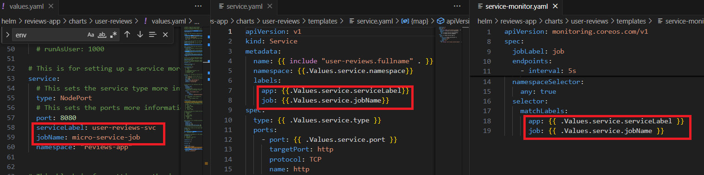
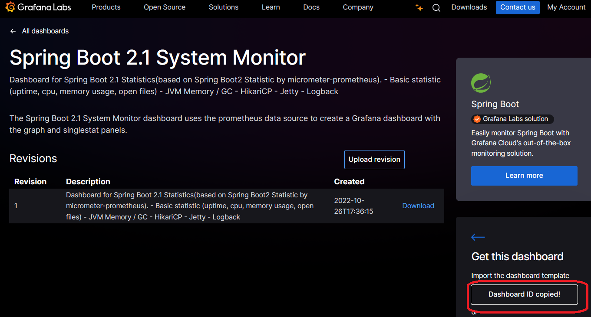
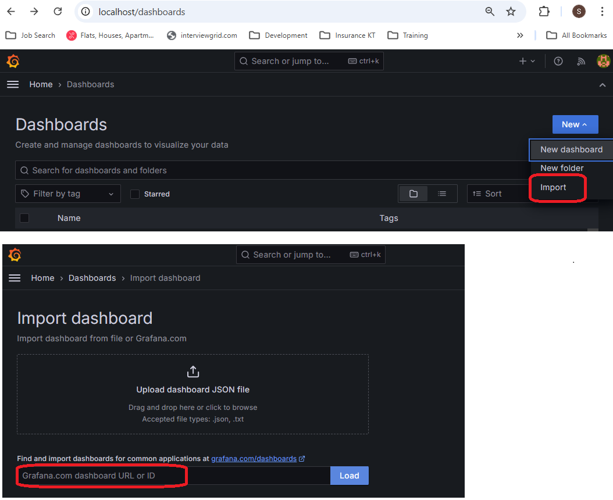
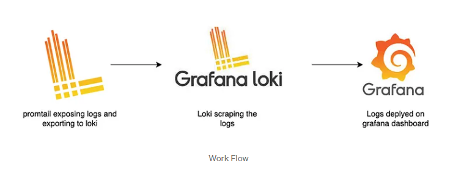

# Observability
Adding observability to Amazon Elastic Kubernetes Service (EKS) involves integrating various tools to monitor, log, and trace the health and performance of your Kubernetes clusters and the applications running on them. Below is a guide on how you can add observability to your EKS environment using AWS-native tools and open-source solutions.

* Key Components of Observability:
    - Monitoring – tracking the performance and health metrics of your infrastructure and applications.
    - Logging – collecting logs from containers, nodes, and Kubernetes control plane.
    - Tracing – understanding request flows through distributed applications.
       - <p>Tracing is simple, in theory. As a request flows from one component to another in a system, through ingress and egress points, tracers add logic where possible to perpetuate a unique trace ID that's generated when the first request is made. As a request arrives at a component along its journey, a new span ID is assigned for that component and added to the trace. A trace represents the whole journey of a request, and a span is each individual hop along the way, each request. Spans may contain tags, or metadata, that can be used to later contextualize the request.
        </p>

## Observability in general
* <a href="https://www.tek-tools.com/apm/best-log-aggregator-tools">Log aggregation system</a>
    - e.g. Loki, Fluentd, Logstash, CloudWatch, DataDog

* <a href="https://signoz.io/blog/distributed-tracing-tools/">Distributed tracing backend</a>
    - e.g. Tempo, Jaeger, Zipkin, CloudWatch, DataDog
    - Fail safe to trace the request is send trace data from APP -> KAFKA -> Zipkin. That way if Zipkin is down at least the trace info is available in Kafka Queue.
    - <a href="https://phoenixnap.com/kb/kafka-on-kubernetes">Install Kafka with StatefulSet</a>
    
* <a href="https://prometheus.io/docs/introduction/comparison/">Time series metrics and monitoring system/database</a>
   
* <a href="https://uptrace.dev/blog/grafana-alternatives.html">Data query, visualize, alerting platform</a>
    - e.g. Grafana, kibana... (see more alternatives)


## Steps to log collection using Docker
* Run Loki and Grafana on same network

```
  docker network create loki-network
  docker run -d --name=loki --network=loki-network -p 3100:3100 grafana/loki:latest
  docker run -d --name=grafana --network=loki-network -p 3000:3000 grafana/grafana:latest
```

* Configure Loki as a Data Source in Grafana
    - Now that both Grafana and Loki are running on the same Docker network, you can configure Grafana to use Loki as a data source.

    - Access Grafana from your browser by visiting http://localhost:3000.

    - Log in to Grafana. The default credentials are:

        Username: admin
        Password: admin (you will be prompted to change it after the first login).

    - Go to Configuration > Data Sources from the Grafana sidebar.

    - Click Add data source.

    - Search for "Loki" and select it.

    - In the HTTP URL field, enter the Loki container's name and port:
       http://loki:3100
      
      Since both Grafana and Loki are on the same Docker network, you can reference the Loki container by its name (loki).

## Troubleshooting Promtail -> Loki > Grafana

To verify that Promtail is successfully sending data to Loki, you can use a few techniques, including checking Promtail logs, verifying data in Loki using Grafana, or querying Loki directly. Here’s a step-by-step guide:

1. Check Promtail Logs
Start by checking Promtail's logs to see if it is able to connect to Loki and successfully push data.

bash
Copy code
kubectl logs <promtail-pod-name> -n <namespace>
Or, if running Promtail in Docker, use:

bash
Copy code
docker logs <promtail-container-name>
Look for messages such as:

Successful connection to Loki ("Successfully sent batch to Loki").
No errors related to network issues or configuration problems.
Log lines indicating that log files are being scraped (e.g., "Found new files" or "Starting tailing new file").
If there are errors, they might provide clues (e.g., "no such host" indicating an incorrect URL, or a 4xx/5xx response if there is an authentication or permissions issue).

2. Query Loki Directly to Check Ingestion
If Loki is receiving logs from Promtail, you should be able to see these logs directly in Loki’s database.

You can query Loki’s API directly to confirm this:

Find Available Log Labels

Use the following command (replace <loki-url> with your Loki server URL) to list available labels, which will help verify if logs from Promtail are arriving:

bash
Copy code
curl -s -G <loki-url>/loki/api/v1/labels
You should see labels like job, host, app, or any custom labels you’ve set in Promtail's configuration.

Query Logs with curl

If labels are available, use a basic query to fetch logs. For example:

bash
Copy code
```curl -s -G -u <username>:<password> --data-urlencode 'query={job="promtail"}'   <loki-url>/loki/api/v1/query```
Replace {job="promtail"} with the actual label set in Promtail’s configuration, and <username>:<password> if using authentication. If logs are being ingested, you should receive log data in the response.

3. Check Logs in Grafana
Open Grafana (typically at ```http://<grafana-url>:3000```).

Go to Explore from the Grafana sidebar.

Select Loki as the data source (configured previously).

Enter a query to look for logs sent by Promtail. Start with a broad query to see all logs:

logql
Copy code
{job="promtail"}
If you see logs, then Promtail is successfully sending data to Loki. You can refine the query to focus on specific labels or fields that should be coming in from your application logs.

4. Enable Loki’s push API Metrics
Loki can expose metrics on data ingestion if it’s configured to run with metrics enabled. These metrics are available at /metrics on Loki’s server.

If metrics are enabled, you can check ingestion metrics to confirm that logs are being received:

bash
Copy code
curl -s <loki-url>/metrics | grep loki_push_received_bytes_total
This metric shows the total number of bytes received by the Loki push API, which should increase as Promtail sends logs.

Common Issues and Troubleshooting Tips
Network Issues: Ensure Promtail can reach Loki by confirming that the URL in Promtail’s config is correct and accessible. You can use ping or curl commands from the Promtail container (if allowed) to verify this.
Authentication Issues: If Loki requires authentication, make sure that Promtail is configured with the correct credentials.
Promtail Configuration: Double-check the promtail.yaml configuration, especially scrape_configs and clients sections, to ensure they point to the correct file paths and Loki endpoint.


## Observability to EKS
* Following options to add Observability.
1. Monitoring with Prometheus and Grafana
2. Logging with Amazon CloudWatch and Fluent Bit
3. Tracing with AWS X-Ray
4. Kubernetes-native Observability Tools
5. Alarms and Notifications with CloudWatch Alarms and SNS:

## Monitoring with Prometheus and Grafana:
* Prometheus: 
    - Open-source monitoring system that scrapes metrics from various sources (Kubernetes, applications, etc.) and stores them in a time-series database.
* Grafana: 
    - Visualization tool for creating dashboards to display the metrics scraped by Prometheus.

### Steps to implement Prometheus & Grafana

- Monitoring K8 pods
    kubectl create namespace monitoring
    helm repo add prometheus-community https://prometheus-community.github.io/helm-charts
    helm repo update
    helm install prometheus prometheus-community/kube-prometheus-stack -n monitoring --create-namespace
    helm install prometheus-operator prometheus-community/kube-prometheus-stack -n monitoring
    kubectl get pods -n monitoring

- Monitoring custom Services
* Install sample web service : ```helm install reviews-app reviews-app```
* _Add Prometheus dependencies to SpringBoot application_

* _Create helm chart (user-reviews) and configure the Helm Chart to expose the Prometheus end point_


* _Copy the SpringBoot Dashboard id from Grafana Labs - 17271_


* _Create new Dash Board in Grafana using Dashboard ID_


### Steps to collect logs from SpringBoot

* Framework

  

* Install Promtail - In each container to collect logs and send it to Grafana Loki
* Install Grafana Loki in central location - Where Grafana UI can collect data to view for end user
* Install Grafana in central location
* Configure SpringBoot to log in mount volume where Promtail can read
* Configure Promtail to read form same volume, and the end point of Grafana Loki
* Test Loki ready status: http://localhost:3100/ready (Note : Not working in my case)
* Test Loki metrics: http://localhost:3100/metrics


## Steps To Deploy in EKS:

* Deploy Prometheus on EKS:

Install the Prometheus Operator (a Helm chart or manual deployment).
Configure service discovery for Prometheus to monitor Kubernetes components, such as nodes, pods, and services.
Use ServiceMonitor and PodMonitor resources to scrape metrics from your applications.
Deploy Grafana on EKS:

Install Grafana using Helm or manually on EKS.
Add Prometheus as a data source in Grafana.
Import pre-built dashboards or create custom ones to visualize Kubernetes and application metrics.

* Sample Dashboard


kubectl -n monitoring apply -f https://raw.githubusercontent.com/prometheus-operator/prometheus-operator/v0.50.0/example/prometheus-operator-crd/monitoring.coreos.com_prometheuses.yaml

kubectl -n monitoring replace -f https://raw.githubusercontent.com/prometheus-operator/prometheus-operator/v0.52.0/example/prometheus-operator-crd/monitoring.coreos.com_prometheuses.yaml

kubectl apply -f https://raw.githubusercontent.com/prometheus-operator/prometheus-operator/master/bundle.yaml
helm repo add stable https://charts.helm.sh/stable
helm install prometheus stable/prometheus-operator

prometheus
kubectl apply -f prometheus.yaml
kubectl port-forward svc/prometheus-operator 8282:8080

---- trial
minikube start
minikune ip

Ref: https://medium.com/@brightband/deploying-prometheus-operator-to-a-kubernetes-cluster-c2378038c79b

Ref: https://github.com/prometheus-community/helm-charts/tree/main/charts/kube-prometheus-stack

ref: https://www.youtube.com/watch?v=5c-o6PKlhEQ

kubectl create namespace monitoring
helm repo add prometheus-community https://prometheus-community.github.io/helm-charts
helm repo update
helm install prometheus prometheus-community/kube-prometheus-stack -n monitoring --create-namespace
helm install prometheus-operator prometheus-community/kube-prometheus-stack -n monitoring
kubectl get pods -n monitoring

kubectl port-forward svc/prometheus-kube-prometheus-prometheus  -n monitoring 9090
kubectl port-forward svc/prometheus-grafana  -n monitoring 80

Grafana:
Username : admin
Password : prom-operator

Password get from the secrets:
kubectl get secret loki-grafana -n loki-stack -o jsonpath="{.data.admin-password}" 
decode password with https://www.base64decode.net/


--Get screts for Grfana
kubectl get secrets -n monitoring
kubectl get secret  prometheus-grafana -o yaml -n monitoring

--get CRD
kubectl get crds
--to see the  service selector
kubectl get crd prometheuses.monitoring.coreos.com -o yaml > serviceMonitor.yaml

--point docker to minikube
minikube docker-env

--get pods from specific namesapce
kubectl get pods -n reviews-app

--get containers in a pod
kubectl get -n reviews-app pods reviews-app-user-reviews-7c4c884946-fhw9c -o jsonpath='{.spec.containers[*].name}'

--get container logs
kubectl logs promtail -n reviews-app

--common port forwards
kubectl port-forward service/prometheus-operator-grafana 80 -n monitoring
--interactive shell 

kubectl -it  exec -n reviews-app reviews-app-user-reviews-7c4c884946-vf44s -- sh

## References
<a href="https://dzone.com/articles/how-to-deploy-apache-kafka-with-kubernetes">Kafka Deployment in K8</a>
