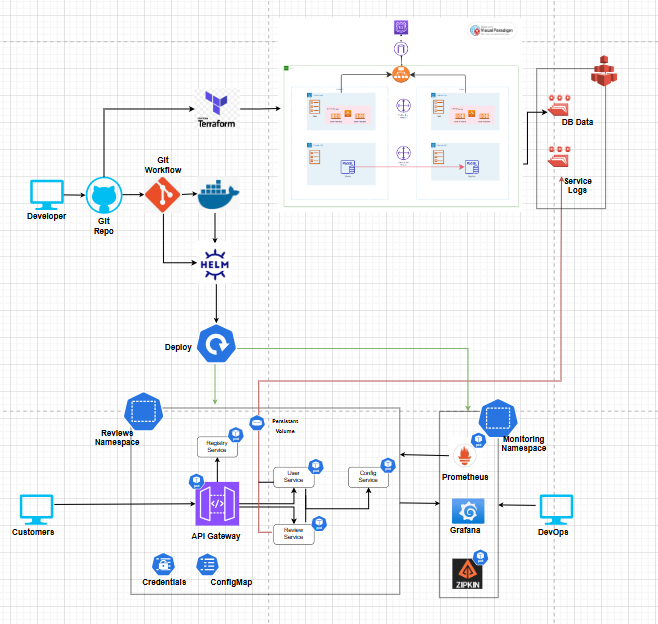

# K8S Observability

This document provides guidance on creating a Kubernetes cluster, developing and deploying microservices, and implementing observability using relevant tools. Since each area is extensive, they are documented separately in individual README files, each linked to this main document for easy navigation.

## Tech Stack

 - SpringBoot is a popular choice for Java developers
 - Spring Data JPA enables data storage
 - Swagger enables Top-down approach, or design-first, and provides UI for testing
 - Terraform creates K8 cluster in CLoud EKS/AKS/GKS
 - Helm Charts packages K8 deployment
  
 ## Details Documents

 - [EKS Cluster Creation](./EKS_CREATTION.md)
 - [K8S Observability](./OBSERVABILITY.md)

 ## Overall Architecture

  -  

  ## Approach

  - Terraform use to create K8 Cluster
  - Git Workflow to prepare build and deployments
  - Helm Charts to deploy the build through Git workflow
  - JPA to store data in MySQL
  - Monitoring using open source components.
  - Create tests using consumer driven contracts (CDC) in groovy language

  ## Overview

  * Micro Services
      
      - Couple of Micro Services (User, Review) provides CRUDs operations and interact with each other to show traceability.
      - User Service calls Review Service using Circuit Breaker, and Retry.

  * API Gateway

        Request Routing
        Load Balancing
        Authentication and Authorization
        Rate Limiting and Throttling
        Data Transformation
        Caching
        Monitoring and Analytics
        Request Aggregation

  * Config Server

        Centralized Configuration Management
        Environment-Specific Configurations
        Dynamic Configuration Updates
        Security and Access Control
        Version Control for Configurations
        Consistency Across Services

  - Registry Service using NetFlex

        Service Discovery
        Dynamic Load Balancing
        Failover and Resilience
        Centralized Health Checks
        Simplified Inter-Service Communication
        Support for Multiple Environments
        Integration with Circuit Breakers
 

